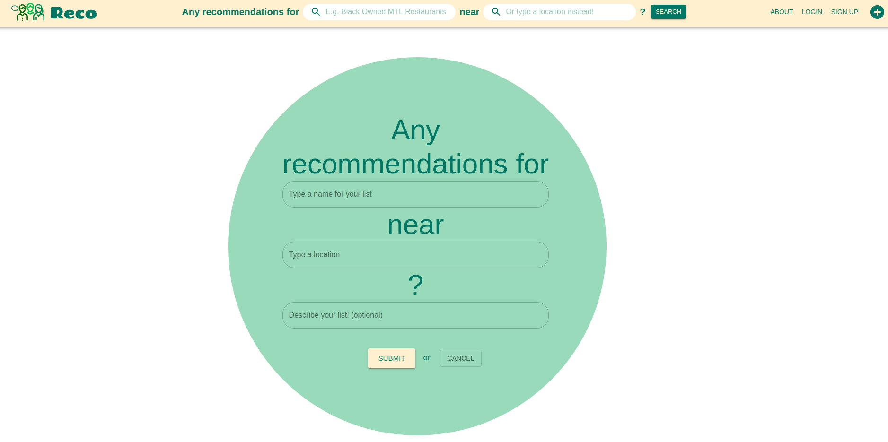
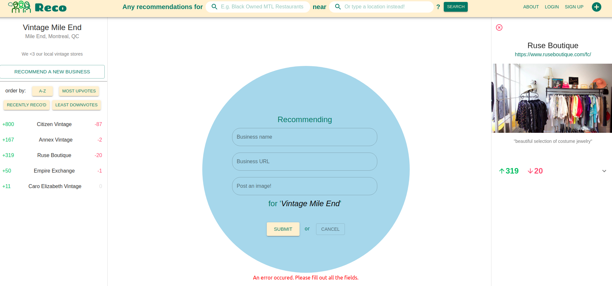

# Reco

Reco is a platform for building community spaces around local businesses through word-of-mouth.
Users create a list asking for recommendations, or respond by adding business contacts.

### Front-end: 
React, Material UI, Framer Motion, [react-bubble-chart-d3](https://github.com/weknowinc/react-bubble-chart-d3)
### Back-end: 
Ruby on Rails, Action Cable websockets, Redis, PostgreSQL

### Steps to run application:

1. Clone the [reco-api](https://github.com/conste11ations/reco-api) repository
2. Clone the [reco](https://github.com/conste11ations/reco) repository
3. In reco-api, run: 
   * `bundle install`
   * `rails db:migrate`
   * `rails db:reset`
    * `rails s`
4. In reco, run:
    * `npm install`
    * `npm start`

The api server with websockets runs on port 3001, the reco app runs on port 3000.
 * http://localhost:3000/
 * http://localhost:3001/

### Sample screenshots

